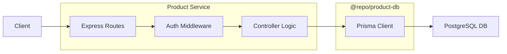

# Thiết Kế Hệ Thống & Vận Hành - Product Service

Tài liệu này mô tả chi tiết về kiến trúc, luồng xử lý và quy trình vận hành của dịch vụ Quản lý Sản phẩm (`product-service`) trong hệ thống Thương mại điện tử Microservices.

## 1. Kiến Trúc Tổng Quan

Dịch vụ được xây dựng trong mô hình **Monorepo** (sử dụng pnpm workspaces), chia làm hai phần chính:

- **`@repo/product-db` (Shared Package)**: Chứa định nghĩa Prisma Schema, cấu hình kết nối CSDL PostgreSQL và thư viện Prisma Client tự động tạo. Điều này giúp các dịch vụ khác (như `order-service`, `inventory-service`) có thể tái sử dụng schema một cách đồng nhất.
- **`product-service` (API Application)**: Ứng dụng Express.js xử lý logic nghiệp vụ, xác thực và cung cấp API RESTful cho Client.

## 2. Luồng Xử Lý (System Flow)

Dưới đây là sơ đồ luồng dữ liệu khi một yêu cầu (Request) được gửi tới hệ thống:



1.  **Routes**: Tiếp nhận Request và chuyển hướng tới Controller tương ứng.
2.  **Middleware**: Thực hiện các tác vụ bổ trợ như kiểm tra JWT (Auth) hoặc xử lý lỗi hệ thống.
3.  **Controller**: Thực hiện logic nghiệp vụ (CRUD), gọi Prisma Client để tương tác với CSDL.
4.  **Prisma Client**: Thư viện ORM giúp thao tác với DB thông qua các hàm Typescript có kiểu dữ liệu chặt chẽ.

## 3. Mô Hình Dữ Liệu (Data Model)

Hệ thống sử dụng các Model chính sau trong `schema.prisma`:

### Product Model
-   **ID**: Tự động tăng.
-   **Price**: Kiểu `Float` (để hỗ trợ các giá trị số thực như 39.9).
-   **Colors & Images**: Lưu trữ theo cơ chế ánh xạ (Mapping). Mỗi màu sắc sẽ tương ứng với một danh sách URL hình ảnh.
-   **Category**: Mối quan hệ bắt buộc (`categorySlug String`). Việc thiết kế này đảm bảo tính toàn vẹn dữ liệu, mỗi sản phẩm phải thuộc về một danh mục cụ thể.

### Category Model
-   Dùng để phân loại sản phẩm. Gắn kết với Product thông qua `categorySlug`.

## 4. Xử Lý Lỗi & Phản Hồi (Design Standards)

-   **Chuẩn hoá Phản hồi (Standard Response)**: Tất cả API đều trả về dữ liệu theo cấu trúc:
    ```json
    {
      "message": "Thông điệp",
      "data": { ... dử liệu trả về ... },
      "count": 0 // (chỉ có ở API danh sách)
    }
    ```
-   **Global Error Handling**: Sử dụng `error.middleware.ts` phối hợp với hàm `next(error)` trong Controller để bắt mọi lỗi ngoại lệ, đảm bảo API không bị "crash" và luôn trả về lỗi 500 kèm thông báo rõ ràng cho Developer.

## 5. Tài Liệu API (Swagger Documentation)

Tài liệu API được tách ra file riêng: `src/docs/product.swagger.ts`.
-   **Ưu điểm**: Giúp file Route (`product.routes.ts`) sạch sẽ, chỉ tập trung vào logic điều hướng.
-   **Dữ liệu mẫu (Mock Data)**: Cung cấp đầy đủ các ví dụ thực tế (Example Request Body & Response) cho từng Endpoint giúp Frontend Developer có thể thử nghiệm API ngay trên giao diện Swagger UI.

## 6. Quy Trình Vận Hành (Operation Guide)

Khi có thay đổi về CSDL hoặc muốn quản lý dữ liệu, lập trình viên sử dụng bộ công cụ từ Prisma:

| Lệnh (Script) | Tác dụng |
| :--- | :--- |
| `pnpm db:generate` | Cập nhật lại types cho Prisma Client dựa trên schema mới nhất. |
| `pnpm db:push` | Đẩy trực tiếp các thay đổi từ schema lên Database (thường dùng trong Dev). |
| `pnpm db:studio` | Mở giao diện web để quản lý, thêm/sửa/xoá dữ liệu trực tiếp trong CSDL. |

---
*Tài liệu này được cập nhật vào ngày 02/04/2026 bởi Antigravity.*
